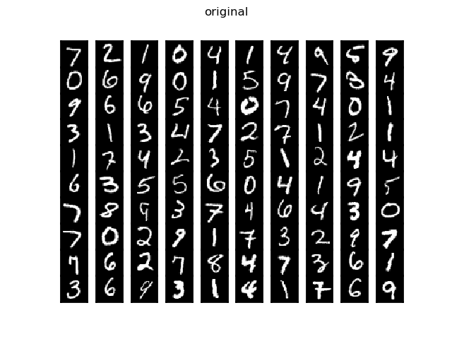
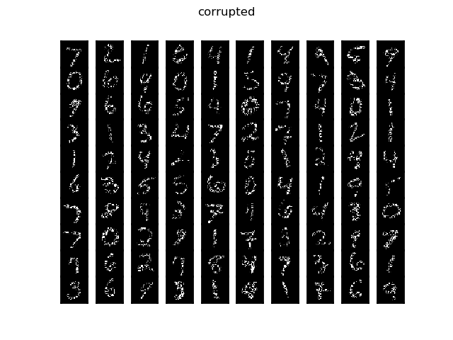
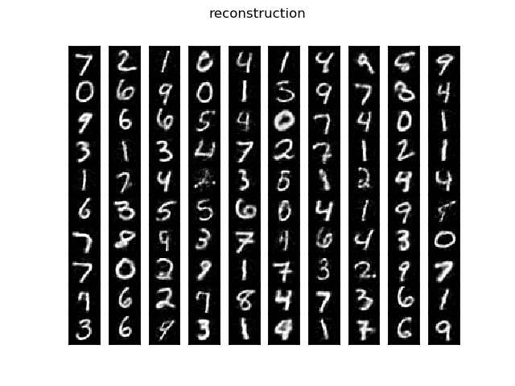
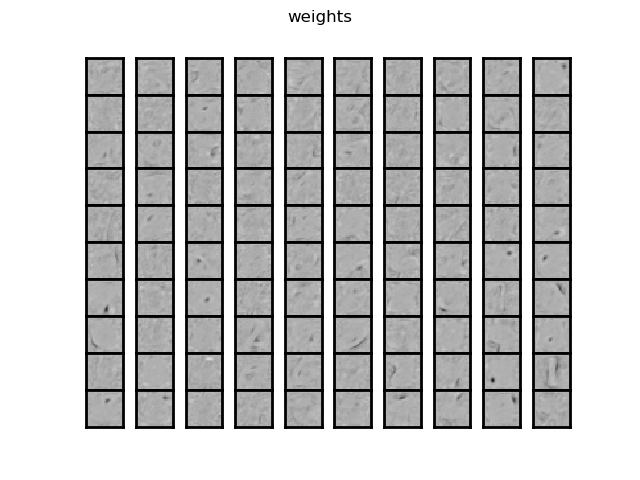

This repository contains an implementation of the denoising autoencoder, as defined in [Stacked Denoising Autoencoders: Learning Useful Representations in a Deep Network with a Local Denoising Criterion](http://www.jmlr.org/papers/volume11/vincent10a/vincent10a.pdf) (P. Vincent, H. Larochelle, I. Lajoie, Y. Bengio and P.A. Manzagol).

Training the encoder on handwritten digit images from the MNIST data set yields reasonable reconstruction performance and generates filters that look like edge and blob detectors:

  
  
  
  

